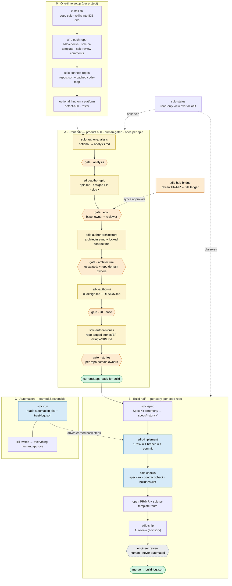
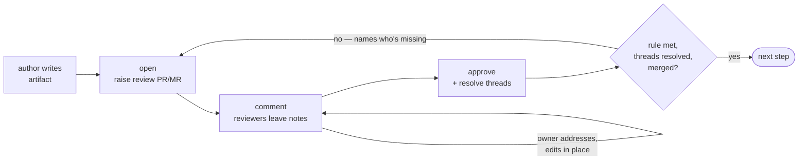

# SDLC Workflow — gated, team, multi-repo SDLC on top of BMAD

[](https://www.npmjs.com/package/@abdelrahmannasr/sdlc-workflow)
[](https://github.com/abdelrahmannasr/sdlc-workflow/actions/workflows/ci.yml)
[](https://docs.npmjs.com/generating-provenance-statements)

A custom BMAD module that turns BMAD from a solo tool into a **team, gated, file-driven SDLC
engine**. Every step does its work, writes its output to a file, and **waits at a gate**. Who
advances the gate (human now; machine later) is a per-step setting. All state lives in files —
nothing hidden, no database.

This repo is the **first deliverable** (see `docs/claude-code-build-plan.md` §10): verified research,
a scaffolded module that installs cleanly, and a working **team review gate** you run by hand.

## The workflow at a glance

The whole lifecycle, from an empty project to shipped code. Setup is one-time; the **front half**
is human-gated and runs once per epic in the product hub; the **build half** runs once per story
per code repo; **automation** is opt-in and earned. `sdlc-status` reads it all; `sdlc-hub-bridge`
mirrors front-half reviews to real PR/MRs.



**Legend.** <span>🟨</span> **artifact** = an author step writes a file and stops; <span>🟧</span>
**gate** = a human review that must pass (`open → comment → approve → advance`); <span>🟦</span>
**earns automation** = a back step that can be set to `machine_advance` once it proves itself;
<span>⬜ dashed</span> **locked** = the engineer review and every front state, **permanently
human**. Detailed walkthroughs for each phase follow below.

## What's here

| Path | What it is |
|------|-----------|
| `RESEARCH-NOTES.md` | Verified Phase 0 facts about BMAD, Spec Kit, Repomix, Impeccable + deviations. |
| `skills/sdlc/` | Module source of truth (`config.yaml`, `module-help.csv`, `install.sh`). Survives BMAD updates. |
| `bin/`, `cli/` | The `sdlc` setup/update CLI (published to npm as `@abdelrahmannasr/sdlc-workflow`). |
| `skills/sdlc-author-analysis/` | Optional front state 1: pressure-test the idea with the analyst into `analysis.md` (skippable). |
| `skills/sdlc-author-epic/` | Front state 1: author an epic with AI assist, assign its `EP-<slug>` ID, seed state. |
| `skills/sdlc-author-architecture/` | Front state 3: author `architecture.md` + the locked `contract.md`; hash-lock the contract surface. |
| `skills/sdlc-author-ui/` | Front state 5: author `ui-design.md` + `DESIGN.md` (Impeccable slash-commands, or graceful fallback). |
| `skills/sdlc-author-stories/` | Front state 7: break the epic into repo-tagged stories with stable `EP-<slug>-S0N` IDs. |
| `skills/sdlc-connect-repos/` | Connect code repos to the hub (GitHub/GitLab, local-user auth); cache a Repomix pack + **code-map** per repo so the front phases are code-aware. |
| `skills/sdlc-review-gate/` | The reusable **team review + approve gate** (used for all four reviews). |
| `skills/sdlc-spec/` | Build Step A: run the Spec Kit ceremony once per story per repo → `specs/<story-id>/`. |
| `skills/sdlc-implement/` | Build Step B: implement ONE atomic task as a small diff on its own branch. |
| `skills/sdlc-checks/` | Build Step C: wire + run the CI gates (spec-link, contract-check, build/test/lint, verified-commits). |
| `skills/sdlc-pr-template/` | Build Step D: install the platform PR/MR template + risk routing (code repos **and** the hub). |
| `skills/sdlc-review-comments/` | Install platform-matched PR/MR review-comment scaffolds (code repos and the hub). |
| `skills/sdlc-hub-bridge/` | The templated PR/MR **review bridge**: open a review PR/MR on the hub and sync platform approvals/comments into the file ledger. |
| `skills/sdlc-ship/` | Build Step E: AI review (advisory) → engineer review → ship + record in the build log. |
| `skills/sdlc-backfill/` | Generate a human-verified spec for already-built code (Repomix), gated per touched feature. |
| `skills/sdlc-run/` | Phase 4 orchestrator: drive a story's back half on the `automation` dial; kill switch. |
| `skills/sdlc-status/` | Read-only view: front chain, build-half dials, trust record, fleet roll-up. |
| `epics/EP-istifta-inquiries/` | A worked demo epic run **end to end** (front half + build half + automation). |
| `demo-repos/` | Throwaway code repos for the build half (separate git repos; regenerable — see `demo-repos/README.md`). |
| `docs/` | The phased build plans (`phase-2`…`phase-5`) and the original workflow design. |
| [`CONTRIBUTING.md`](CONTRIBUTING.md) | Commit & PR/MR title convention (Conventional Commits, lowercase after the type). |

## The `sdlc` CLI (install, update, reconcile)

The module ships a zero-dependency CLI, published to npm as
[`@abdelrahmannasr/sdlc-workflow`](https://www.npmjs.com/package/@abdelrahmannasr/sdlc-workflow). Run it
with `npx` from your **product hub** repo — no clone needed.

| Command | What it does |
|---------|--------------|
| `npx @abdelrahmannasr/sdlc-workflow setup` | Guided first-run wizard (the steps below). |
| `npx @abdelrahmannasr/sdlc-workflow check` | Read-only report: what is **missing** / **outdated** (drifted) / **stale** (code-context) vs the bundled manifest. |
| `npx @abdelrahmannasr/sdlc-workflow check --fix` | Reconcile: fill what is missing **and** update what changed — touches nothing already correct. |
| `npx @abdelrahmannasr/sdlc-workflow update` | Apply drift only (alias for `check --fix --scope=changed`). |
| `sdlc gate open <epic> <artifact>` | Open the front-half **review PR/MR** for an artifact and mark the step `in_review`. |
| `sdlc gate sync <epic> [artifact]` | Pull the PR/MR's reviews + comment threads into the file ledger; **auto-advance** the step when approvals are satisfied, all threads are resolved, and the PR is merged. |
| `sdlc gate comments <epic> [artifact]` | Fetch the unresolved review comments to address (then reply on the PR; reviewers resolve their threads). |
| `sdlc gate status <epic>` | Show each review step and its recorded approvals. |
| `sdlc gate ci [--branch <head>] [--pr <n>]` | The CI entry the hub workflow calls on review/merge events: derive the epic/artifact from the `review/EP-*` branch, run the same sync, and commit **only the ledger** to the hub default branch (sweep every open review PR when no `--branch`). |
| `sdlc commit --type <t> -m <subject>` | Commit by the SDLC convention — Conventional subject, `Task`/`Contract-Change`/`Co-Authored-By` trailers, atomic-file guard. |
| `sdlc open-pr [--repo <name>]` | Open a code-repo **task** PR/MR from the repo's platform template (build half). |
| `sdlc repo list` / `sdlc repo refresh [name]` | List connected repos as **fresh / stale**, and re-pack a stale one — staleness is now an explicit human decision, never an automatic skill side-effect. |
| `npx @abdelrahmannasr/sdlc-workflow --version` | Print the installed CLI version. |

Flags: `--dir <path>` targets a project other than the cwd; `--force` re-copies unchanged files (or
bypasses the commit atomic guard). Commit flags: `--type`, `-m/--message`, `--task`, `--ai
<claude\|copilot\|cursor\|coderabbit\|none>`, `--contract-change`, `--dry-run`. `open-pr` flags:
`--repo`, `--risk <low\|medium\|high>`, `--contract-change`.

### The PR-driven review gate

The front-half gate now rides the **PR/MR you open per step** (`sdlc gate open`). Reviewers approve and
comment on the platform; `sdlc gate sync` maps that state into the file ledger (`approvals.json`,
`comments.json`, `reviews/*.md`) — which stays the source of truth — and the step **auto-advances on
merge** once three things hold: the reviewer rule is satisfied (owner + 1 reviewer, plus a domain-owner
per touched repo on escalated steps), every comment thread is resolved, and the review PR/MR is merged.
The merge click is the human approval act, so front steps still never `machine_advance`. Approvals are
**revoked when the reviewed artifact actually changes** (re-hash), giving reviewers a fresh pass. With no
hub platform / no `gh`/`glab`, the gate degrades to file-only with no error.

**Event-driven sync.** Wire the hub once (`sdlc check --fix` installs `.github/workflows/sdlc-gate-sync.yml`,
or the GitLab fragment + schedule) and every **approval, change request, and merge** on a review PR/MR
triggers `sdlc gate ci` in the hub's own CI: the ledger updates land directly on the hub's default branch
— no manual `sdlc gate sync` needed (it stays valid as the fallback). CI never approves and never merges;
the human keeps the merge click. GitLab caveat: approvals are only picked up by the ~15-min scheduled
sweep (GitLab fires no pipeline on approval) — details in `skills/sdlc-hub-bridge/references/bridge.md`.

### What `setup` walks you through (7 steps)

1. **Preflight** — confirm the hub is a git repo (offers `git init`); check `git`/`node`/`npx`.
2. **Install the module** — copy all 17 `sdlc-*` skills into the IDE skill dirs you pick
   (`.claude/`, `.agents/`, `.zencoder/`, `.opencode/`) and register `_bmad/sdlc/`.
3. **Hub platform & roster** — detect GitHub/GitLab from the remote; record reviewers → `.sdlc/hub.json`.
4. **Connect code repos** — register each repo into `.sdlc/repos.json` and cache a Repomix pack.
5. **Wire each repo** — CI gates, PR/MR template, and review-comment scaffold.
6. **AI review** — optionally write `.coderabbit.yaml`.
7. **Done** — stamp `.sdlc/cli-version.json` and hand off the AI-only steps (code-maps; first epic).

The deterministic file work runs automatically; the AI-only steps are handed to the Claude Code skills
with a printed next-action. Re-run `… check --fix` any time the workflow updates — it never re-asks for
input you already gave.

**Releases:** automated via semantic-release on merge to `main` (Conventional Commits → npm, with
provenance). See [`RELEASING.md`](RELEASING.md).

**Maintainers / no-CLI fallback:** the underlying copy is still a single script —
`bash skills/sdlc/install.sh` — which the CLI's install step is a port of. The **source** stays in
`skills/`, which a `bmad-method` update does not touch, so after any BMAD update just re-run the CLI
(`… check --fix`) or the script.

> **Releases are automated.** A `feat:`/`fix:` commit merged to `main` triggers
> [semantic-release](https://semantic-release.gitbook.io/): it computes the version from the
> [Conventional Commits](CONTRIBUTING.md), publishes to npm with build provenance (tokenless OIDC),
> ships the `CHANGELOG.md` in the tarball, and cuts a GitHub release. No manual `npm publish`. See
> [`RELEASING.md`](RELEASING.md).

## Agent skills (all 17)

The CLI **installs and wires** the module; the skills below are the **agents you invoke by name** in your
AI IDE (e.g. *“run `sdlc-author-epic`”*) to actually do the work. State lives in files you can also edit
directly. Each skill stops at a gate and never auto-advances unless a step has *earned* automation.

### Setup & code-awareness

- **`sdlc-connect-repos`** — Connects code repos to the product hub so the front/"brain" phases are
  code-aware. Registers N code repos (GitHub or GitLab, local-user auth, no stored tokens) into
  `.sdlc/repos.json`, then caches an AI-readable picture of each — a compressed Repomix pack and a
  lightweight code-map (existing endpoints/events/data-models/modules), secret-scanned. Idempotent and
  refreshable; staleness tracked by HEAD sha.

### Front half — author the "thinking" (once per epic, human-gated)

- **`sdlc-author-analysis`** — *Optional* front state 1. With the analyst, pressure-test a feature idea
  and write the discovery brief into `analysis.md`. Assigns the `EP-<slug>` ID and seeds `.sdlc/` state
  (the 10-step chain that puts analysis before epic). If skipped, the epic step does this shaping inline.
- **`sdlc-author-epic`** — The epic front state. Shape the idea with the analyst (or read `analysis.md`
  when it already ran), then write the epic with the pm into `epic.md`. The entry point when analysis is
  skipped: assigns the `EP-<slug>` ID and seeds `.sdlc/` state.
- **`sdlc-author-architecture`** — Front state 3. With the architect, author `architecture.md` and the
  locked `contract.md` (the shared cross-repo surface), then hash-lock the contract surface into
  `.sdlc/contract-lock.json`. Reads `epic.md`; escalates on the contract risk tag.
- **`sdlc-author-ui`** — Front state 5. With the ux-designer, author `ui-design.md` and `DESIGN.md`,
  driving Impeccable as harness slash-commands (document/extract/craft) when installed, or authoring
  directly when not. Reads epic + architecture.
- **`sdlc-author-stories`** — Front state 7. With the pm, break the approved epic into user stories, each
  tagged with the repos that must implement it. Assigns zero-padded `EP-<slug>-S0N` IDs, one file per
  story under `stories/`. Reads epic + architecture + contract + UI.

### The review gate (cross-cutting — used by every review)

- **`sdlc-review-gate`** — The reusable team review + approve gate. Shares an authored artifact, records
  reviewer comments and approvals as files, enforces the **owner + 1 reviewer** rule (escalating to
  domain owners on contract/auth/payments), and advances the epic state **only** when approval is
  recorded.
- **`sdlc-hub-bridge`** — The templated PR/MR bridge for the front-half gate. When the hub has a platform
  (`.sdlc/hub.json`), it opens a review PR/MR per artifact, sets the required reviewers/labels, and
  provides the read-only `gh`/`glab` recipes that sync platform comments + approvals back into the file
  ledger. The file ledger stays the source of truth; degrades to a file-only gate with no platform.
- **`sdlc-review-comments`** — Installs platform-matched PR/MR review-comment scaffolds so reviewers
  leave structured, attributable feedback that maps cleanly into the file ledger.

### Build half — turn stories into shipped code (once per story, per repo)

- **`sdlc-spec`** — Step A. For one ready-for-build story and one of its repos, run the Spec Kit ceremony
  once (specify → clarify → plan → analyze → checklist → tasks) → `specs/<story-id>/`. Drives `/speckit.*`
  when installed; references the locked contract — never re-invents the surface.
- **`sdlc-implement`** — Step B. With the dev lens, implement **one** atomic task as a small diff
  (≤3 files) on its own branch. The diff stays inside the files the task declared (flag and STOP if it
  would grow). Commit ends with the task ID; `Contract-Change: yes` only if it touches the locked
  contract surface.
- **`sdlc-checks`** — Step C, the production-safety gates. Wire and run three CI gates: **spec-link**
  (every change links a real story/spec), **contract-check** (a contract-surface diff without a
  re-locked contract FAILS), and **build/test/lint**. CI-agnostic bash for GitHub Actions and GitLab CI.
- **`sdlc-pr-template`** — Step D. Detect the repo's platform and commit the matching PR/MR template with
  an Impact & Risk block; high risk (or a contract/auth/payments surface) routes the review to domain
  owners. Includes `risk-route.sh`.
- **`sdlc-ship`** — Step E. AI review (CodeRabbit, advisory) → engineer review (the human gate, owner +
  1 reviewer with the same escalation) → on merge, record the ship in the epic build-log and update the
  story state so the epic → story → task → PR chain stays traceable.
- **`sdlc-backfill`** — Step G. Generate specs for already-built features in an existing repo so new work
  doesn't break them: pack one feature at a time with Repomix, write a DRAFT spec, require human approval
  before it counts. A change is blocked only until the features it touches have approved specs.

### Automation & status

- **`sdlc-run`** — The Phase 4 orchestrator. Drives a story's back-half loop (spec → tasks → implement →
  checks) on each step's automation dial, recording every run in the trust log. A clean `checks` pass
  auto-advances to engineer-review; any failure, scope overrun, or contract-surface touch HALTS for a
  human. Also sets a step's dial (gated by trust evidence) and flips the system-wide kill switch.
- **`sdlc-status`** — Read-only view of an epic: the current step, each step's dials (assistance/
  automation) and status, which approvals are still required, per-story back-half trust records, the
  kill-switch state, and a fleet roll-up across epics.

## The two dials (per step, build plan §2)

- **assistance:** `none` | `review` | `heavy` — how much AI helps.
- **automation:** `human_approve` | `machine_advance` — who advances the step.

Defaults: every step starts `human_approve`. The four **front** authoring steps (epic, architecture,
UI, stories) and their reviews are **locked** — they may not be set to `machine_advance` in this
version. A front state advances only on a **human act** — recording an approval and `advance`, or
merging the approved, fully-resolved review PR — never on a machine.

As of **Phase 4a** the `automation` dial is no longer inert: the orchestrator `sdlc-run` reads it and,
for the safe **back** steps, advances on its own when a step is set to `machine_advance` (and has
*earned* it — see "Run the back half on the dial" below). The engineer review and all four front
states stay `human_approve` forever.

## Using the workflow end to end (all the steps, in order)

This is the full path from nothing to shipped code. Each numbered step names the skill to invoke; the
detailed sections below expand every phase. Invoke a skill by name in your agent/IDE (e.g. *“run
`sdlc-author-epic`”*); state lives in files you can also edit directly.

### 0 — One-time setup

> **Shortcut:** `npx @abdelrahmannasr/sdlc-workflow setup` walks through steps 1, 4, 5 and 6 below
> interactively (module install, hub detect + roster, connect repos, wire each repo). Run
> `… check --fix` any time afterwards to reconcile. The manual steps below are the long-hand
> equivalent and still work.

1. **Install the module:** `bash skills/sdlc/install.sh` (re-run after any BMAD update).
2. **Have your code repo(s).** They are **separate git repos** (one `.git` each). For the demo they
   live under `demo-repos/<repo>/` — regenerate from `demo-repos/README.md`.
3. **Optional tools** (the workflow degrades gracefully and records it if any are absent): **Spec Kit**
   (`/speckit.*`), **Impeccable** (`/impeccable …`), **Repomix** (`npx repomix`, used by
   `sdlc-connect-repos` and `sdlc-backfill`), **CodeRabbit** (advisory AI review).
4. **Wire each code repo once:** `sdlc-checks repo:<repo> action: wire` (installs the CI gates —
   *merges* with any existing CI, never clobbers), `sdlc-pr-template repo:<repo> action: wire` (PR/MR
   template + risk routing), `sdlc-review-comments repo:<repo> action: wire` (review-comment scaffold).
5. **Connect each code repo to the hub** (so the front phases see what's already built):
   `sdlc-connect-repos action: connect repo:<repo> path:<path-or-git_url> domain_owner:<who>`. It
   registers the repo in `.sdlc/repos.json` and caches a Repomix pack + a lightweight **code-map**
   (existing endpoints/events/data-models/modules, secret-scanned). Clones/fetches as the **local user**
   (SSH or credential helper; GitHub or GitLab; no stored tokens). Re-run for any new repo. Freshness is a
   **human decision**: `sdlc repo list` shows fresh/stale, `sdlc repo refresh [name]` re-packs a moved repo
   (skills flag staleness and point here — they never silently re-pack). Greenfield → skip it.
6. **(Optional) Put the hub on a platform** so the front-half review runs through real PRs:
   `sdlc-connect-repos action: detect-hub`, then `action: roster` once per reviewer (login → SDLC
   name + role), and `sdlc-pr-template repo:hub action: wire` / `sdlc-review-comments repo:hub action:
   wire` / `sdlc-checks repo:hub action: wire`. With no hub platform the front gate just runs file-only.
7. **Conventions:** commits and PR/MR titles follow Conventional Commits (lowercase after the type), the
   human author owns each commit with an optional per-commit `Co-Authored-By` AI trailer — see
   [`CONTRIBUTING.md`](CONTRIBUTING.md).

### A — Front half (human-authored, once per epic)
Each author step writes its artifact, sets itself `done`, moves `currentStep` to its review, and
**stops at the gate**. Run every gate with **`sdlc-review-gate`** — or, when the hub is on a platform,
drive it deterministically with the **`sdlc gate`** CLI (`open → sync → … → merge`): the review rides
the per-step PR/MR and the step **auto-advances on merge** once approvals are satisfied and all comment
threads are resolved. Details: **“Run the full front half by hand”** below.

6. `sdlc-author-epic` → `epic.md` (assigns `EP-<slug>`, seeds state) → review (base rule).
7. `sdlc-author-architecture` → `architecture.md` + locked `contract.md` → review (**escalated**: contract).
8. `sdlc-author-ui` → `ui-design.md` + `DESIGN.md` → review (base rule).
9. `sdlc-author-stories` → repo-tagged `stories/EP-<slug>-S0N.md` → review (**per-repo**).
   → `state.json` reaches `currentStep: ready-for-build`.

### B — Build half (per story, per repo)
From a `ready-for-build` story, for **each** repo the story is tagged with. Details: **“Run the full
build half by hand”** below.

10. `sdlc-spec story:<id> repo:<repo>` → writes `specs/<story-id>/` (spec/plan/tasks + `link.md`).
11. `sdlc-implement story:<id> repo:<repo> task:<T0N>` → one atomic task = one branch = one commit
    (repeat per task). Commit by convention with **`sdlc commit --type <t> -m <subject> [--ai <tool>]`**
    (Task/Contract-Change/Co-Authored-By trailers, atomic-file guard).
12. `sdlc-checks repo:<repo> action: run` → spec-link, contract-check, build/test/lint, and
    verified-commits (platform-Verified signature + roster-allowlisted author) must pass.
13. Open the PR/MR from the wired template with **`sdlc open-pr --repo <repo> [--risk <level>]`**;
    `sdlc-pr-template repo:<repo> action: route` prints the required reviewers from the Impact & Risk block.
14. `sdlc-ship` → `ai-review` (advisory) → `approve` (the human engineer gate) → `ship` (merge, record
    in `build-log.json`, update story status to `in-build`/`shipped`).
    - **Multi-repo:** repeat 10–14 in each repo, all from the **one** locked contract.
    - **Existing code:** `sdlc-backfill` first, to produce a human-verified spec for a built feature.

### C — Automation (optional, earned over time)
15. After a back step accumulates trust evidence, earn it:
    `sdlc-run action: set-dial step:<step> to: machine_advance` (refused if evidence is short or for a
    front state / the engineer review).
16. Drive a story's back half on the dials: `sdlc-run story:<id> repo:<repo>` — it auto-advances
    earned steps and stops for a human otherwise, always halting at the engineer review.
17. **Kill switch any time:** `sdlc-run action: kill` (everything → manual) / `action: unkill`.
Details: **“Run the back half on the dial”** below.

### Any time
- **`sdlc-status [EP-<slug>]`** — read-only: the front chain, each build step's dial + status, the
  trust record, and (across epics) the fleet roll-up. Start here to see what's blocking.

## Run the full front half by hand

The front half walks **epic → review → architecture+contract → review → UI design → review → stories
→ review → `ready-for-build`**. It is all files under `epics/EP-<slug>/`. The skills below guide you,
but you can also edit the files directly — that's the point.

Each authoring step is the same shape: an author skill produces an artifact, sets its step `done`,
moves `currentStep` to the matching review, and **stops at the gate**. Then **`sdlc-review-gate`**
(one gate, reused for all four reviews) takes `open → comment → approve → advance`. When the hub is on a
platform, the **`sdlc gate`** CLI runs that gate over a real PR/MR — `open` raises the review PR, `sync`
pulls approvals + comment threads into the ledger, and the step **auto-advances when the approved,
fully-resolved PR is merged** (the merge is the human approval act).

**Code-aware (when repos are connected).** If you ran `sdlc-connect-repos` in setup, each author step
first loads the connected repos' **code-maps** (from `.sdlc/code-context/<repo>/`) so it considers what
already exists: the epic references existing behaviour, **the architecture cross-checks the contract
surface against existing endpoints/events/entities before hash-locking it**, the UI reuses existing
components, and stories anchor to real modules. Each artifact stamps what it read in its `code-context:`
frontmatter; a repo that has moved since connect triggers a staleness warning — the step **flags it and
stops**, pointing you at `sdlc repo refresh <repo>` (refreshing is a human decision, never an automatic
side-effect). With no repos connected the steps proceed exactly as before (greenfield-safe).

### Author steps
1. **`sdlc-author-epic`** (state 1) → `epic.md`; assigns the stable `EP-<slug>` ID; seeds
   `.sdlc/state.json` (all `human_approve`, front steps locked) + empty `.sdlc/approvals.json`.
2. **`sdlc-author-architecture`** (state 3) → `architecture.md` + the locked `contract.md`; writes the
   contract-surface SHA-256 to `.sdlc/contract-lock.json`.
3. **`sdlc-author-ui`** (state 5) → `ui-design.md` + `DESIGN.md` (drives Impeccable
   `document|extract|craft` slash-commands when installed; otherwise authors directly).
4. **`sdlc-author-stories`** (state 7) → one file per story `stories/EP-<slug>-S0N.md`, each tagged
   with the `repos` it implements.

### The one gate (every review)

Every review is the same loop — author writes, reviewers comment (which never advances), approvals
accumulate, and the step moves forward only when the rule is met. **File-only** ends in an explicit
`advance`; **PR-driven** (hub on a platform) ends when the approved, fully-resolved review PR is
**merged**:



**File-only** — invoke **`sdlc-review-gate`** with `open` (present the artifact; reviewers comment in
`reviews/<artifact>--<date>--comments.md`), `approve` (name + role → `.sdlc/approvals.json`), and
`advance` (moves **only if** the rule is satisfied, else it names the missing approval).

**PR-driven** — when the hub is on a platform, the **`sdlc gate`** CLI runs the same gate over a PR/MR:
- `sdlc gate open <epic> <artifact>` — raise the review PR/MR; mark the step `in_review`.
- `sdlc gate sync <epic> [artifact]` — pull approvals + comment threads into the **same** ledger (your
  own `gh`/`glab`, no stored tokens) and **auto-advance on merge** once the rule is met and every thread
  is resolved. Approvals are **revoked when the reviewed artifact changes** (re-hash), so reviewers get
  a fresh pass. Unresolved comments hold the step `in_review`.
- `sdlc gate comments <epic>` fetches the open threads to address; `sdlc gate status <epic>` shows
  approvals (counting only the non-stale ones). The file ledger stays the source of truth; with no
  platform / no CLI it degrades to file-only.

**The gate rule, by review:**
- **Base** (epic, UI): `owner + 1 reviewer`.
- **Escalated** (architecture+contract — `risk_tags: ["contract"]`): base **plus a domain owner for
  every repo in `epic.repos`**. The contract-surface hash must still match `.sdlc/contract-lock.json`
  (a changed surface invalidates approvals).
- **Per-repo** (stories): base **plus a domain owner (the repo's engineer) for every repo that appears
  in any story's `repos`**.

### Check status anytime
Invoke **`sdlc-status`** (read-only) to see the full 8-step chain, every step's dials/status, the
contract lock, story repo tags, and which approvals the active gate still needs.

## Worked example (already in this repo)

`epics/EP-istifta-inquiries/` shows the **whole front half** walked end to end:
- `epic.md` authored + approved (epic gate, base rule) — 2026-06-04.
- `architecture.md` + `contract.md` authored; contract surface hash-locked in
  `.sdlc/contract-lock.json`. Architecture gate **escalated** (contract): owner *alice* + reviewer
  *bob* + domain owners *carol* (backend) and *dave* (mobile).
- `ui-design.md` + `DESIGN.md` authored (Impeccable not installed → graceful fallback). UI gate base
  rule (alice + bob).
- Five repo-tagged stories `stories/EP-istifta-inquiries-S01..S05.md`. Stories gate **per-repo**: base
  rule + a domain owner for each touched repo (carol/backend, dave/mobile).
- `state.json` now reads `currentStep: ready-for-build`, every front step `done` — the Phase 3
  handoff point.

Inspect it:
```bash
cat epics/EP-istifta-inquiries/.sdlc/state.json
cat epics/EP-istifta-inquiries/.sdlc/approvals.json
cat epics/EP-istifta-inquiries/.sdlc/contract-lock.json
ls  epics/EP-istifta-inquiries/reviews/
ls  epics/EP-istifta-inquiries/stories/
# re-verify the contract surface still matches its lock:
awk '/CONTRACT-SURFACE:BEGIN/{f=1;next} /CONTRACT-SURFACE:END/{f=0} f' \
  epics/EP-istifta-inquiries/contract.md | shasum -a 256
```

## Run the full build half by hand (Phase 3)

From a `ready-for-build` story, the **build half** turns one atomic task into shipped code through
gates that protect production. Per-repo specs live in each code repo; the contract stays singular in
the product repo. Code repos are **separate git repos** under `demo-repos/<repo>/` (gitignored;
`demo-repos/README.md` explains regeneration). **Nothing auto-advances** — every gate is human-owned.

1. **Spec** — `sdlc-spec` runs the heavy Spec Kit ceremony **once per story per repo**
   (`specify`→`clarify`→`plan`→`analyze`→`checklist`→`tasks`), writing `specs/<story-id>/` and a
   `link.md` back to the story (drives `/speckit.*` when installed, else degrades). It **quotes** the
   locked contract; it never widens it.
2. **Implement** — `sdlc-implement` (the `dev` step): one atomic task = one branch
   (`feat/<story>-<task>-…`) = one PR. The diff stays inside the files the task declared. Commit with
   **`sdlc commit`** — it builds the conventional subject, derives the `Task:` trailer from the branch
   (add `--contract-change` only if the locked surface is touched), appends an optional `--ai` co-author,
   and refuses a non-atomic stage. Open the PR with **`sdlc open-pr --repo <repo>`** (template prefilled).
3. **Check gates** — `sdlc-checks` wires three CI gates (GitHub + GitLab) that must pass before merge:
   **spec-link** (links a real story/spec), **contract-check** (a contract-surface change without
   `Contract-Change` + a re-locked contract FAILS, routing back to the architecture gate),
   **build/test/lint**. They fail closed on a bad base ref.
4. **PR/MR template + risk routing** — `sdlc-pr-template` drops the platform-matched template with an
   Impact & Risk block; `high` risk (or a contract/auth/payments surface) routes the review to domain
   owners (`risk-route.sh`), the same escalation as the gate.
5. **AI review → engineer review → ship** — `sdlc-ship`: CodeRabbit is an advisory first pass (never
   the authority); a human engineer approves (owner + 1 reviewer, escalating to domain owners); on
   merge the ship is recorded in `.sdlc/build-log.json` and the story state becomes `in-build` →
   `shipped`. The epic → story → task → PR → mergeCommit chain is traceable both ways.

**Multi-repo:** a story tagged `repos: [backend, mobile]` runs the above in each repo independently from
the **one** locked contract; the contract-check blocks a surface bypass in either repo.

**Backfill existing code:** `sdlc-backfill` packs one feature with **Repomix** (`npx repomix`, secret-scan
by default), drafts an *unverified* spec ("describe what exists, do not invent"), a human approves it,
and `backfill-check.sh` blocks a change to that feature until its spec is approved — gated per touched
feature, never the whole repo.

The build half is walked end to end on the worked epic: story **S01** shipped (`status: shipped`,
three tasks in `build-log.json`), **S03** built across backend + mobile, and a `health` feature
backfilled. The code repos are regenerable from `demo-repos/README.md`.

## Run the back half on the dial (Phase 4 — automation, earned)

Phase 4 is **automation, earned with evidence and reversible in one move**. Phase 4a made the
`automation` dial real and earned the safest step (the check-gate advance); Phase 4b added the
`implement → check` hand-off and the `spec`/`tasks` trust hooks. The engine is `sdlc-run`; the
evidence lives in two new files per epic under `.sdlc/`: `build-state/<story-id>.json` (the back steps
with their dials, per repo) and `trust-log.json` (every run's verdict). See
`docs/phase-4-build-plan.md` and `docs/phase-4b-build-plan.md`.

- **Drive a story's back half:** `sdlc-run {story} {repo}` walks `spec → tasks → implement → checks`,
  reading each step's dial. On `machine_advance` it advances on its own; on `human_approve` it stops
  for a human; on any FAIL, scope overrun, or contract-surface touch it **halts and pulls in a human**.
  It always stops at the engineer review (`sdlc-ship`), which is never automated.
- **Read the trust log:** `sdlc-status {epic}` shows each back step's dial, status, and trust record —
  runs, % `approved-unchanged`, and whether that clears the threshold (`automation.trust_threshold` in
  `config.yaml`, default ≥5 runs and ≥80% unchanged). The engineer review records each run's verdict
  (a diff merged as-authored is `approved-unchanged`; one edited first is `approved-with-edits`; a
  failed one is `rejected`).
- **Earn automation for a step:** once a step's trust record clears the threshold,
  `sdlc-run action: set-dial step: checks to: machine_advance` flips it. The setter **refuses** if the
  evidence is short, or for any front state / the engineer review. Reverting
  (`to: human_approve`) is always allowed — automation is reversible in one move.
- **Kill switch:** `sdlc-run action: kill` forces every step back to `human_approve` system-wide
  instantly (no code change, no per-step edits); `sdlc-run action: unkill` restores earned automation.

**Earned so far:** `checks` (Step B, Phase 4a) and `implement` (Step D, Phase 4b — the
`implement → check` hand-off; the scope/contract halts and the engineer review still gate the merge).
`tasks` (Step C) and `spec` have their dials + trust hooks but stay `human_approve` until their own
runs clear the threshold — there is no historical signal to seed them from, so they are earned only on
genuine runs (never fabricated). See `docs/phase-4b-build-plan.md`.

## What's intentionally NOT built yet

**Phase 4b Step C** (the remaining automation): `tasks` generation advance — gated until real
`tasks`/`spec` trust evidence accrues. The hook that records that evidence is built; the dial flips
only once the threshold is genuinely met. The scope guard and contract-surface halt always override
the dial, and **front states and the engineer review stay `human_approve`, permanently.**

**Phase 5 (conditional):** the optional service layer (watch repos, run earned-automation steps
unattended, read-only dashboards), built only when the CLI genuinely can't keep up, with git remaining
the source of truth. It is **trigger-gated** — `docs/phase-5-build-plan.md` is the build plan: its
three parts (read-index, unattended runner, dashboard) each ship only when *their* bottleneck is
measured, with the hard rules they inherit and the instrumentation (already shipped in `sdlc-status`)
that makes the decision data-driven. See also `docs/claude-code-build-plan.md` §8.
