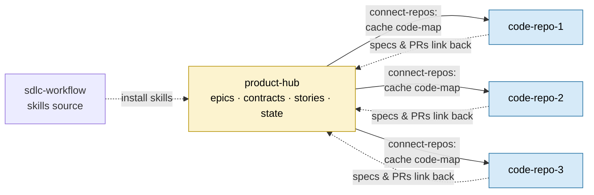
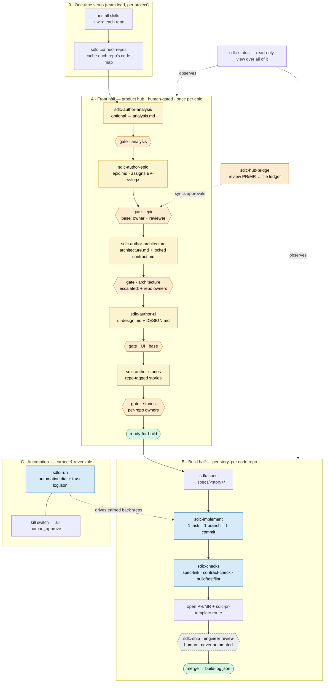
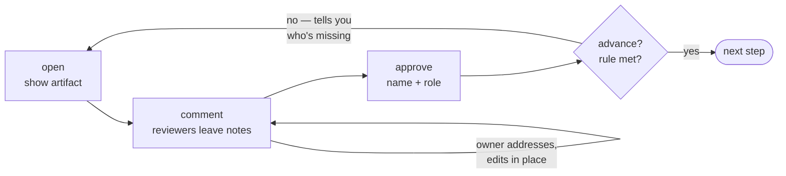

# Team Guide — how to use this workflow with 1 product hub + 3 code repos

This is the short, plain-language version of `README.md`, written for a developer team. If you only read
one page before starting, read this one. The full reference is in `README.md`.

---

## 1. The big picture

### Your four repos

You will have **four separate git repos**, each with one job:

```
  sdlc-workflow   ──►  the SKILLS SOURCE
  (this repo)          You install the workflow skills from here, and pull updates from here.
                       No real product work happens inside it.

  product-hub     ──►  the THINKING
  (new repo)           All epics, contracts, stories, reviews, and state.
                       Lives under: epics/EP-<slug>/

  code-repo-1     ──►  the CODE
  code-repo-2          Real application code. Each story's spec lives here too,
  code-repo-3          under: specs/<story-id>/  — and every PR links back to its
                       story in the product hub.
```



**The handoff rule:** everything *up to and including the locked contract* lives in the **product hub**.
Everything *from the spec onward* (specs, tasks, code) lives in each **code repo**.

### The whole workflow, end to end

Setup is one-time. The **front half** is human-gated and runs once per epic in the hub; the **build
half** runs once per story per code repo; **automation** is opt-in and earned. `sdlc-status` reads it
all; `sdlc-hub-bridge` mirrors front-half reviews to real PR/MRs on the hub.



**Legend.** 🟨 **artifact** = an author step writes a file and stops · 🟧 **gate** = a human review
that must pass (`open → comment → approve → advance`) · 🟦 **earns automation** = a back step that
can later auto-advance once it proves itself · ⬜ dashed **locked** = the engineer review and every
front state, **permanently human**.

---

## 2. The workflow has two halves

- **Front half = decide.** Done once per epic, in the **product hub**. Always human-approved — nothing
  auto-advances. This is where you agree on the epic, the architecture, the locked contract, the UI, and
  the stories.
- **Back half = build.** Done once per story, per code repo, **inside that code repo**. Spec → implement →
  check → ship.

Each step writes a file and then **stops at a gate**. A human moves it forward. That is the whole idea.

---

## 3. One-time setup (the team lead does this once)

**a. Create the product hub repo.** Just an empty git repo. You don't need to scaffold anything — the
first `sdlc-author-epic` run creates `epics/EP-<slug>/` and its state files for you.

**b. Make sure your 3 code repos exist.** Each is its own separate git repo (its own `.git`).

**c. Install everything with the CLI.** From the product hub repo, run the guided setup — it installs the
skills into the IDE dirs, detects the hub platform, connects your code repos, and wires each one (CI gates,
PR/MR template, review-comment scaffold):

```bash
cd <product-hub-repo>
npx @abdelrahmannasr/sdlc-workflow setup
```

> Re-run `npx @abdelrahmannasr/sdlc-workflow check --fix` after any workflow update — it reports what is
> missing / drifted / stale and reconciles only what changed (it never re-asks for what you already
> answered).

<details>
<summary>Manual fallback (no CLI)</summary>

```bash
git clone <sdlc-workflow-url> && cd sdlc-workflow
mkdir -p ~/.claude/skills
for s in sdlc-author-analysis sdlc-author-epic sdlc-author-architecture sdlc-author-ui sdlc-author-stories \
         sdlc-connect-repos sdlc-review-gate sdlc-spec sdlc-implement sdlc-checks \
         sdlc-pr-template sdlc-review-comments sdlc-hub-bridge sdlc-ship sdlc-backfill \
         sdlc-run sdlc-status; do
  rm -rf ~/.claude/skills/$s && cp -R skills/$s ~/.claude/skills/$s
done
```

Re-run this block after you `git pull` updates into `sdlc-workflow`.
</details>
>
> **Alternative:** if you'd rather not have each person install, commit the `sdlc-*` skill folders into
> the product hub repo itself (under `.claude/skills/`). Then anyone who clones the hub gets the skills
> automatically. The user-level install above is the recommended default.

**d. Wire each code repo once.** From inside the hub (or with the repo path), run for each of the 3 repos:

```text
sdlc-checks          repo:<repo> action: wire   # installs the CI gates (merges with existing CI, never clobbers)
sdlc-pr-template     repo:<repo> action: wire   # installs the PR/MR template + risk routing
sdlc-review-comments repo:<repo> action: wire   # installs the PR/MR review-comment scaffold
```

> **Wiring is additive.** `sdlc-checks` detects any CI you already have and *merges* the gates in
> (GitHub: a separate `sdlc-checks.yml`; GitLab: an `include:` of `.gitlab/ci/sdlc-checks.yml`) — it
> never edits a foreign workflow. Re-running any `wire` is a no-op.

**d2. Wire the product hub itself** (so the front-half review can run through real PRs on the hub):

```text
sdlc-connect-repos action: detect-hub                              # records the hub's platform in .sdlc/hub.json
sdlc-connect-repos action: roster login:<gh-login> name:<sdlc-name> role:<owner|reviewer>   # once per reviewer
sdlc-pr-template     repo:hub action: wire                         # hub's front-half PR/MR body template
sdlc-review-comments repo:hub action: wire                         # hub's review-comment scaffold
sdlc-checks          repo:hub action: wire                         # hub-flavored gates (owner-set / contract-locked / approvals-present)
sdlc-hub-bridge      action: wire                                  # event-driven gate sync (CI runs `sdlc gate ci` on approve/request-changes/merge)
```

The roster maps each reviewer's GitHub/GitLab **login** to their SDLC **name + role**; domain-owners are
derived from each repo's `domain_owner` in `repos.json` (not retyped). With the hub on a platform, the
front-half gate opens a review PR per artifact and `sdlc-review-gate action: sync` pulls approvals/
comments back. No platform (or `bridge_enabled: false`)? The gate just runs file-only — skip d2.

With the gate-sync CI wired, you usually don't run `sync` at all: every approval, change request, and
merge on a review PR triggers it in the hub's CI, and the ledger update is committed straight to the
hub's default branch (`git pull` to see it). CI never approves or merges — the merge click stays human.
GitLab caveat: a bare approval is only picked up by the ~15-min scheduled sweep (one-time schedule +
`SDLC_GATE_TOKEN`; recipe in the skill).

**e. Connect your code repos to the hub (so the brain knows what's already built).** From inside the
hub, run once per code repo — and again any time you add a new one:

```text
sdlc-connect-repos action: connect repo:<repo> path:<path-or-git_url> domain_owner:<who>
```

This registers the repo in `.sdlc/repos.json` and caches an AI-readable picture of it (a Repomix pack +
a lightweight **code-map** of its existing endpoints/events/data-models/modules, secret-scanned). The
front-half steps then read that map so they don't re-design or contradict code that already exists.
It clones/fetches as **you** (your own SSH key or git credential helper — GitHub *or* GitLab, no stored
tokens). Greenfield with no code yet? Skip this — the brain just proceeds. When a repo's code moves,
`sdlc-connect-repos action: refresh repo:<repo>`; to see freshness, `action: list`.

**f. Optional tools.** The workflow uses these if present and **degrades gracefully** (and records it)
if they're missing: **Spec Kit** (`/speckit.*`), **Impeccable** (`/impeccable …`), **Repomix**
(`npx repomix`, used by `sdlc-connect-repos` and `sdlc-backfill`), **CodeRabbit** (advisory AI review).
You can start without any of them.

---

## 4. Onboarding a team member (every developer, copy-paste)

1. Clone the **product hub** and the **code repos** you'll work in.
2. Install the skills once (same block as step 3c above):

```bash
git clone <sdlc-workflow-url> && cd sdlc-workflow
mkdir -p ~/.claude/skills
for s in sdlc-author-analysis sdlc-author-epic sdlc-author-architecture sdlc-author-ui sdlc-author-stories \
         sdlc-connect-repos sdlc-review-gate sdlc-spec sdlc-implement sdlc-checks \
         sdlc-pr-template sdlc-review-comments sdlc-hub-bridge sdlc-ship sdlc-backfill \
         sdlc-run sdlc-status; do
  rm -rf ~/.claude/skills/$s && cp -R skills/$s ~/.claude/skills/$s
done
```

3. That's it. Open Claude Code **in the product hub** to work on epics; open it **in a code repo** to
   build stories.

To run a skill, just ask your agent by name — e.g. *"run `sdlc-author-epic`"*. All state is plain files
you can also read and edit directly.

---

## 5. Running an epic — the front half (in the product hub)

Do these in order. After each author step, the matching review opens and **waits** — you clear it with
`sdlc-review-gate` (`action: open → comment → approve → advance`).

| # | Run this | It produces | Then approve at |
|---|----------|-------------|-----------------|
| 0 *(optional)* | `sdlc-author-analysis` | `analysis.md` — the analyst's discovery brief (assigns the `EP-<slug>` ID, seeds state) | analysis review |
| 1 | `sdlc-author-epic` | `epic.md` (reads `analysis.md` when present; otherwise assigns the `EP-<slug>` ID and seeds state itself) | epic review |
| 2 | `sdlc-author-architecture` | `architecture.md` + the **locked** `contract.md` | architecture review *(escalated)* |
| 3 | `sdlc-author-ui` | `ui-design.md` + `DESIGN.md` | UI review |
| 4 | `sdlc-author-stories` | one file per story, `stories/EP-<slug>-S0N.md`, each tagged with the repos it touches | stories review *(per-repo)* |

Step 0 is **optional**: run `sdlc-author-analysis` first for a dedicated, gated discovery pass; skip it
and the epic step does that analyst shaping inline. Each author step opens its own branch
(`<step>/EP-<slug>`) at the start. When all front gates pass, the epic state reaches
**`currentStep: ready-for-build`**. Now you can build.

> **The brain is code-aware.** If you connected your code repos in setup (step 3e), each author step
> first loads the connected repos' **code-maps** — so the epic references what exists, the architecture
> **cross-checks the contract against existing endpoints/models before locking it**, the UI reuses
> existing components, and stories anchor to real modules. Each artifact records what it read in its
> `code-context:` frontmatter. If a repo's code has moved since you connected it, the step warns and
> points you at `sdlc-connect-repos action: refresh`.

**The gate, every time** (`sdlc-review-gate`) — the same loop for all five reviews. Commenting never
advances; only `advance` moves forward, and only when the rule is met:



- `action: open` — show the artifact; reviewers leave comments. *Commenting never advances.* If the hub
  is on a platform (step 3d2), this also opens a review **PR/MR on the hub** for the artifact.
- `action: approve` (name + role) — recorded in `.sdlc/approvals.json`. *Or* reviewers approve/comment on
  the hub PR and you run `action: sync` to pull that platform state into the ledger.
- `action: advance` — moves forward **only if** the rule is met; otherwise it tells you who's still missing.
  (Merging the review PR does **not** advance — `advance` does; the file ledger stays the source of truth.)
- With the hub's gate-sync CI wired (step 3d2), `sync` runs **automatically** on every platform
  approval / change request / merge and commits the ledger to the hub's default branch — the same
  predicate, just triggered by the event instead of a human command.

---

## 6. Building a story — the back half (in a code repo)

From a `ready-for-build` story, do this **inside each code repo the story is tagged with**:

1. **Spec** — `sdlc-spec story:<id> repo:<repo>` → writes `specs/<story-id>/` (spec/plan/tasks +
   `link.md` back to the story). It *quotes* the locked contract; it never widens it.
2. **Implement** — `sdlc-implement story:<id> repo:<repo> task:<T0N>` → **one task = one branch = one
   commit**. Repeat per task. The first run installs a `.gitmessage` commit template: the human author
   owns the commit, with a required `Task:` trailer and an optional per-commit `Co-Authored-By:` for the
   AI tool that helped (chosen from `config.yaml` `build.ai_coauthor.allowed`).
3. **Check** — `sdlc-checks repo:<repo> action: run` → the gates must pass: spec-link,
   contract-check, build/test/lint, and verified-commits (every commit signed with a
   platform-Verified key and authored by a roster-known email — on the hub and every repo).
4. **Open the PR/MR** (the template is already wired) and run
   `sdlc-pr-template repo:<repo> action: route` to print the required reviewers.
5. **Ship** — `sdlc-ship` → AI review (advisory) → **engineer approval (a human)** → merge. The ship is
   recorded in `build-log.json` and the story moves to `in-build` → `shipped`.

**Multi-repo story?** A story tagged `repos: [backend, mobile]` just runs steps 1–5 in *each* repo,
independently, all from the **one** locked contract.

**Existing/legacy code?** Run `sdlc-backfill` first to produce a human-verified spec for the built
feature before changing it.

---

## 7. Who approves what (the gate rules)

From `skills/sdlc/config.yaml` — the base rule is **owner + 1 reviewer**, with escalation on risky
surfaces (`contract`, `auth`, `payments`):

| Review | Who must approve |
|--------|------------------|
| Epic | owner + 1 reviewer |
| UI | owner + 1 reviewer |
| **Architecture + contract** | owner + 1 reviewer **+ a domain owner for every repo in the epic**. The contract surface is hash-locked — changing it invalidates approvals. |
| **Stories** | owner + 1 reviewer **+ the engineer for each touched repo** |
| **Engineer review at ship** | a human engineer — **always, never automated** |

---

## 8. Handy anytime

- **See what's blocking:** `sdlc-status` (or `sdlc-status EP-<slug>`) — read-only view of the whole
  chain, every step's status, the contract lock, and which approvals a gate is still waiting on. Start
  here when stuck.
- **Automation is opt-in and earned.** You can ignore `sdlc-run` entirely at first — every step is
  human-approved by default. Later, safe back-half steps can *earn* auto-advance once they prove
  themselves. The engineer review and all four front steps are **never** automatable.
- **Global "back to manual" switch:** `sdlc-run action: kill` forces every step to human approval
  instantly; `sdlc-run action: unkill` restores it.
- **Keep the install in sync with the CLI** (run from the product hub):
  - `npx @abdelrahmannasr/sdlc-workflow check` — report what's missing / drifted / stale (read-only).
  - `npx @abdelrahmannasr/sdlc-workflow check --fix` — reconcile it (re-syncs skills + repo wiring).
  - `npx @abdelrahmannasr/sdlc-workflow update` — apply drift only.
  - `npx @abdelrahmannasr/sdlc-workflow --version` — the installed CLI version.

---

## 9. Naming cheat sheet

IDs are **immutable once assigned** — renaming them breaks every downstream link.

| Thing | Format | Example |
|-------|--------|---------|
| Epic ID | `EP-<slug>` | `EP-istifta-inquiries` |
| Story ID | `EP-<slug>-S0N` | `EP-istifta-inquiries-S01` |
| Task ID | `EP-<slug>-S0N-T0N` | `EP-istifta-inquiries-S01-T03` |
| Branch | `feat/<story-id>-<task-id>-<short-slug>` | `feat/EP-istifta-inquiries-S01-T01-create-inquiry` |
| Commit trailer | `Task: <story-id>-<task-id>` (add `Contract-Change: yes` only if the locked contract surface is touched) | — |

Commits and PR titles follow Conventional Commits (lowercase after the type, e.g. `feat: …`, `fix: …`).

---

## 10. The skills at a glance (what to invoke)

The CLI installs and wires everything; these are the **agents you invoke by name** in your IDE. Full
descriptions are in [`README.md`](README.md) → *Agent skills (all 17)*.

| Skill | When you reach for it |
|-------|------------------------|
| `sdlc-connect-repos` | Register a code repo with the hub + cache its code-map (setup / new repo). |
| `sdlc-author-analysis` | *(Optional)* pressure-test an idea into `analysis.md` before the epic. |
| `sdlc-author-epic` | Start a feature: write `epic.md`, assign the `EP-<slug>` ID. |
| `sdlc-author-architecture` | Author `architecture.md` + the locked `contract.md`. |
| `sdlc-author-ui` | Author `ui-design.md` + `DESIGN.md`. |
| `sdlc-author-stories` | Break the epic into repo-tagged stories (`EP-<slug>-S0N`). |
| `sdlc-review-gate` | Review / comment / approve / advance **any** gate. |
| `sdlc-hub-bridge` | Open the review PR/MR on the hub and sync platform approvals back. |
| `sdlc-review-comments` | Install the PR/MR review-comment scaffolds. |
| `sdlc-spec` | Spec a ready story in one repo (Spec Kit ceremony). |
| `sdlc-implement` | Implement one atomic task as a small branch. |
| `sdlc-checks` | Wire / run the CI gates (spec-link, contract-check, build/test/lint, verified-commits). |
| `sdlc-pr-template` | Install the platform PR/MR template + risk routing. |
| `sdlc-ship` | AI review → engineer review → ship + record. |
| `sdlc-backfill` | Spec already-built / legacy code so new work doesn't break it. |
| `sdlc-run` | Drive the back half on the automation dial; kill switch. |
| `sdlc-status` | Read-only: where an epic is, dials, approvals owed, trust records. |

---

## 11. Want more detail?

- **`README.md`** — the complete reference for every phase, dial, gate, and all 17 skills.
- **`RELEASING.md`** — how the `sdlc` CLI is published to npm.
- **`epics/EP-istifta-inquiries/`** — a full worked epic (front half + build half) you can copy from.
